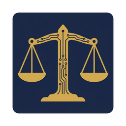
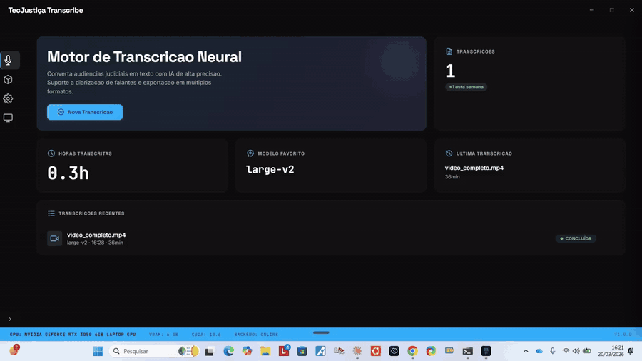
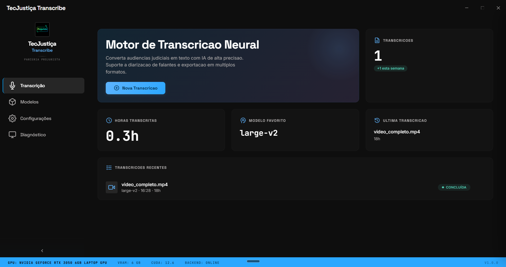
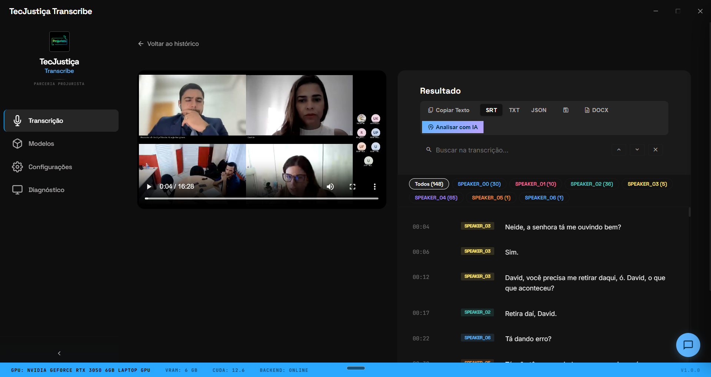
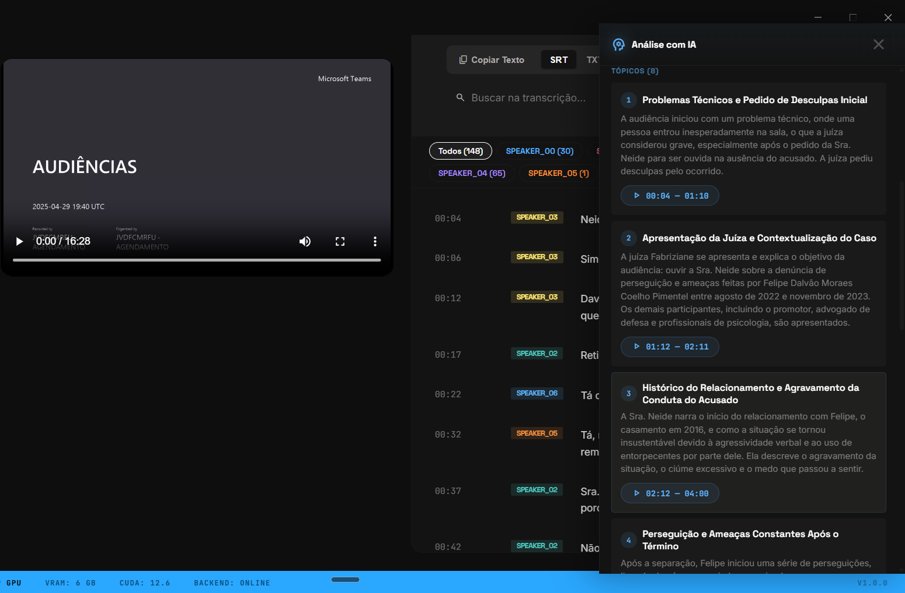
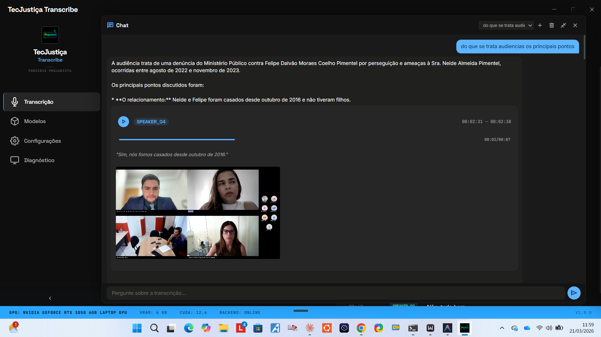

<p align="center">
  
</p>

<h1 align="center">
   TecJustiça Transcribe
</h1>

<p align="center">
  <strong>Transcrição automática de audiências judiciais, 100% local, com IA.</strong><br>
  <sub>Produto <strong>TecJustiça</strong> · em parceria com Projurista</sub>
</p>

<p align="center">
  <a href="#-instalação">Instalação</a> •
  <a href="#-funcionalidades">Funcionalidades</a> •
  <a href="#-requisitos">Requisitos</a> •
  <a href="#-para-desenvolvedores">Desenvolvedores</a> •
  <a href="#-comunidade--recursos">Comunidade</a> •
  <a href="#-licença">Licença</a>
</p>

<p align="center">
  
  
  
  
  
  
</p>

<p align="center">
  <a href="https://tecjustica.substack.com/"></a>
  <a href="https://github.com/marcosmarf27/tecjustica"></a>
</p>

---

### 🎬 Demo

<p align="center">
  <a href="https://github.com/marcosmarf27/tecjustica-transcribe-app/raw/main/docs/assets/demo.mp4">
    
  </a>
</p>

<p align="center">
  <sub>▶ <a href="https://github.com/marcosmarf27/tecjustica-transcribe-app/raw/main/docs/assets/demo.mp4">Assistir ao demo completo (4 min, MP4, 8,6 MB)</a></sub>
</p>

## ✨ Por que existe

Servidores e magistrados do Judiciário brasileiro gastam horas transcrevendo audiências manualmente. Serviços de transcrição em nuvem esbarram em **sigilo processual (CNJ 615)** e **LGPD** — o áudio não pode sair da máquina.

O **TecJustiça Transcribe** resolve isso: roda **100% offline** depois do setup inicial, usa [WhisperX](https://github.com/m-bain/whisperX) com aceleração CUDA quando há GPU NVIDIA, e entrega o texto pronto com diarização e timestamps. Sem servidor externo, sem API-key, sem dado trafegando.

## 🧩 Funcionalidades

<p align="center">
  
</p>

### Transcrição com player sincronizado

- Áudio e vídeo — MP3, WAV, M4A, OGG, FLAC, MP4, MKV, AVI, MOV, WebM
- Modelos WhisperX (`tiny` → `large-v2`) — você escolhe precisão vs. velocidade
- **Diarização** (quem está falando) via pyannote.audio
- Edição inline (double-click no segmento, Ctrl+Enter salva)
- Busca com highlight (Ctrl+F), prev/next
- Exportação em **TXT, SRT, DOCX**
- Processamento em background — navegue pelo app enquanto roda

<p align="center">
  
</p>

### Análise com IA (opcional)

- Resumo automático da audiência
- Extração de pontos-chave, pedidos e decisões
- Usa Google Gemini (key opcional — dá para desligar e usar só a transcrição)

<p align="center">
  
</p>

### Chat com a transcrição

- Faça perguntas em linguagem natural sobre o conteúdo
- Streaming de respostas
- Histórico de conversas por transcrição

<p align="center">
  
</p>

## 🖥️ Requisitos

### Windows

| | |
|---|---|
| **SO** | Windows 10 (1709+) ou Windows 11, 64-bit |
| **RAM** | 8 GB mínimo, 16 GB recomendado |
| **Disco** | ~4 GB livres (instalador + dependências) |
| **Internet** | Apenas no primeiro uso (~3 GB de download) |
| **GPU** | NVIDIA recomendado — driver 560+ para CUDA 12.6 (funciona sem GPU, porém mais lento) |

> **ffmpeg já vem empacotado no instalador.** Python é detectado automaticamente (ou instalado via `winget` se ausente). Nada para fazer manualmente.

### Linux

| | |
|---|---|
| **SO** | Ubuntu 20.04+ ou equivalente, x86_64 |
| **RAM** | 8 GB mínimo, 16 GB recomendado |
| **Disco** | ~4 GB livres |
| **Python** | 3.10–3.13 — `sudo apt install python3 python3-venv` |
| **GPU** | NVIDIA recomendado — driver 560+ com CUDA toolkit |

> ffmpeg também vem empacotado no AppImage.

## 📦 Instalação

### Windows — instalador (recomendado)

Baixe o `.exe` mais recente em **[Releases](../../releases/latest)** e execute. O app aparece no Menu Iniciar.

### Windows — PowerShell

```powershell
irm https://raw.githubusercontent.com/marcosmarf27/tecjustica-transcribe-desktop/main/install.ps1 | iex
```

### Linux — AppImage

```bash
curl -fsSL https://raw.githubusercontent.com/marcosmarf27/tecjustica-transcribe-desktop/main/install.sh | bash
```

Isso baixa o AppImage, instala em `~/.local/bin/` e cria atalho no menu de aplicativos.

## 🚀 Primeiro uso

Na primeira vez o app:

1. Detecta **Python** 3.10–3.13 (ou instala via `winget` no Windows)
2. Cria um **venv isolado** em `%APPDATA%\tecjustica-transcribe\python-env` (Windows) ou `~/.config/tecjustica-transcribe/python-env` (Linux)
3. Instala **PyTorch + WhisperX + FastAPI** com wheels CUDA 12.6 (~3 GB, 10–30 min)
4. Sobe o **backend FastAPI** em uma porta local aleatória

A partir daí, cada abertura leva segundos.

## 🏗️ Arquitetura

```
┌───────────────────────────────────────────┐
│ Electron App                              │
│  ├─ Main Process (main.js)                │
│  │   • Janela, IPC, SQLite, auto-restart  │
│  │   • Setup Python + venv (1x)           │
│  │   • Spawna backend + injeta PATH       │
│  │                                        │
│  ├─ Renderer (renderer/*.js, index.html)  │
│  │   • UI VS Code-like, 4 páginas         │
│  │   • Dashboard, Transcrição, Modelos,   │
│  │     Diagnóstico, Análise, Chat         │
│  │                                        │
│  └─ resources/bin/ffmpeg(.exe)            │
│      • ffmpeg estático bundled            │
└──────────────┬────────────────────────────┘
               │ HTTP + SSE (localhost)
┌──────────────▼────────────────────────────┐
│ Backend Python (FastAPI)                  │
│  • /transcribe (SSE progress)             │
│  • /models (download via HF Hub)          │
│  • /gpu-info, /diagnostics                │
│  • Pipeline WhisperX com limpeza          │
│    progressiva de VRAM                    │
└───────────────────────────────────────────┘
```

**Decisões de design:**

- **Backend em processo separado** (não in-process Node) — isolamento de memória, reinício fácil quando CUDA crasha.
- **SSE em vez de WebSocket** para progresso — simples, unidirecional, funciona com qualquer cliente HTTP.
- **Limpeza progressiva de VRAM** — cada estágio do pipeline (modelo → align → diarize) é carregado, usado e liberado antes do próximo, permitindo `large-v2` em GPUs de 6 GB.
- **ffmpeg bundled** — zero dependências externas no Windows. No Linux, o AppImage também leva junto.

## 🛠️ Para desenvolvedores

### Clone e dev

```bash
git clone https://github.com/marcosmarf27/tecjustica-transcribe-desktop.git
cd tecjustica-transcribe-desktop
npm install
npm run download:ffmpeg   # baixa ffmpeg bundled para resources/bin/
npm start                 # roda o app em modo dev
```

O modo dev usa o **venv do usuário final** — se já instalou o app, ele reusa. Senão, o próprio setup roda na primeira vez.

### Build dos instaladores

```bash
npm run dist:linux        # gera .AppImage
npm run dist:win          # gera .exe NSIS (requer wine no Linux)
```

Os scripts `predist:*` baixam os binários estáticos do ffmpeg (~80 MB por plataforma) antes de empacotar.

### Estrutura do repo

```
.
├─ main.js                 # processo principal Electron
├─ preload.js              # bridge segura (contextBridge)
├─ index.html              # shell do renderer
├─ styles.css              # tema VS Code dark
├─ renderer/               # frontend modular (state, nav, pages)
├─ python-backend/         # FastAPI + WhisperX + GPU utils
│  ├─ server.py
│  ├─ transcriber.py
│  ├─ gpu_utils.py
│  ├─ model_manager.py
│  └─ requirements.txt
├─ scripts/
│  └─ download-ffmpeg.js   # baixa ffmpeg estático (pre-build)
├─ resources/bin/          # binários ffmpeg (gitignored)
├─ assets/                 # ícones e logos
└─ docs/assets/            # screenshots e GIFs do README
```

### Rodar só o backend

```bash
cd python-backend
python -m venv venv
source venv/bin/activate   # .\venv\Scripts\activate no Windows
pip install --extra-index-url https://download.pytorch.org/whl/cu126 -r requirements.txt
python server.py --port 8000
```

Depois: `curl http://127.0.0.1:8000/gpu-info`.

### Contribuindo

Contribuições são bem-vindas. Abra uma issue primeiro se for uma mudança grande, ou mande um PR direto para bugfixes. Tente manter o código no estilo existente (VS Code-like UI, pub/sub no renderer, SSE no backend).

## 🤝 Stack

- [Electron](https://www.electronjs.org/) 41.x — shell desktop
- [WhisperX](https://github.com/m-bain/whisperX) 3.8.2 — ASR com alinhamento word-level
- [PyTorch](https://pytorch.org/) 2.8.0 + CUDA 12.6
- [FastAPI](https://fastapi.tiangolo.com/) — backend HTTP
- [pyannote.audio](https://github.com/pyannote/pyannote-audio) — diarização
- [ffmpeg](https://ffmpeg.org/) — decodificação de mídia (bundled)

## ⚖️ Conformidade

- **CNJ Resolução 615/2025** — processamento local, sem envio de dados a terceiros
- **LGPD** — áudio e transcrição permanecem na máquina do usuário
- O token HuggingFace é opcional e fornecido pelo usuário (apenas para diarização)

## 🌐 Comunidade & Recursos

Gosta do projeto? Acompanhe mais conteúdo sobre tech + justiça:

<table>
<tr>
<td width="50%">

### 📬 Newsletter TecJustiça

Artigos sobre IA aplicada ao Direito, automação de processos, LGPD, CNJ 615 e as ferramentas que a gente vem construindo.

**[→ Inscreva-se no Substack](https://tecjustica.substack.com/)**

</td>
<td width="50%">

### 🧩 Marketplace de Plugins & Skills

Coleção aberta de plugins, agentes e skills para profissionais do Direito. Automação, busca jurisprudencial, análise de peças e mais.

**[→ github.com/marcosmarf27/tecjustica](https://github.com/marcosmarf27/tecjustica)**

</td>
</tr>
</table>

## 📄 Licença

[MIT](LICENSE) — use, modifique, distribua. Se ajudar, mande um ⭐.

---

<p align="center">
  <strong>TecJustiça</strong> <sub>em parceria com Projurista</sub><br>
  <em>Tecnologia a serviço da Justiça.</em>
</p>
